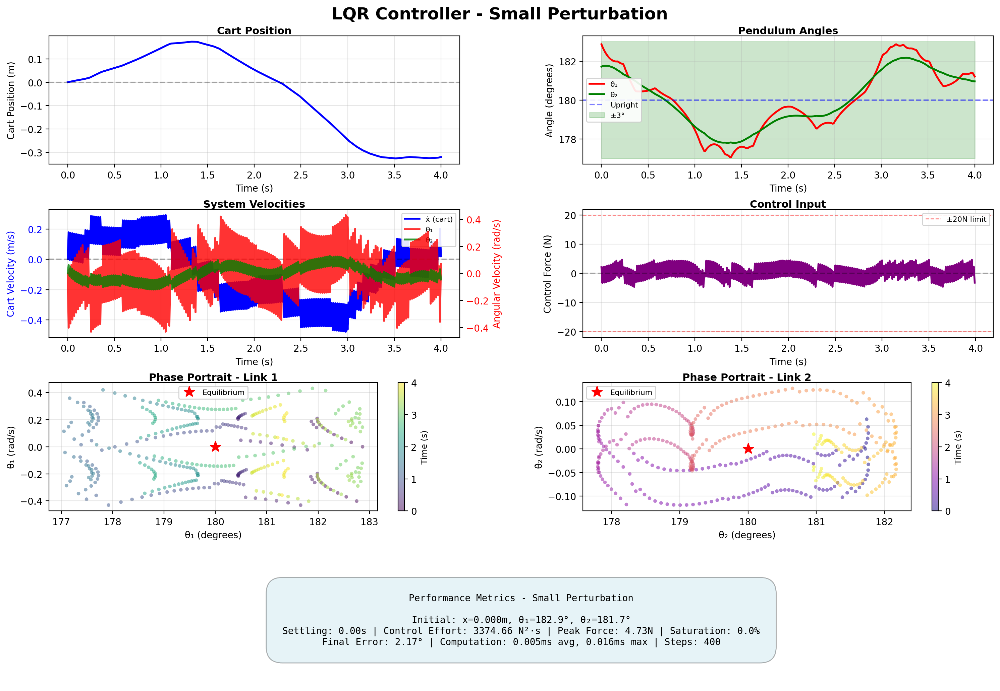
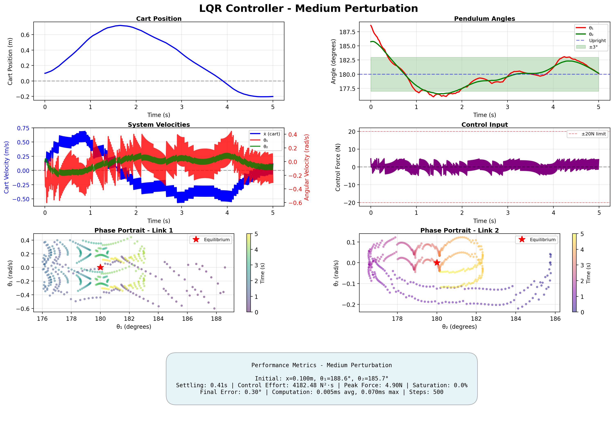
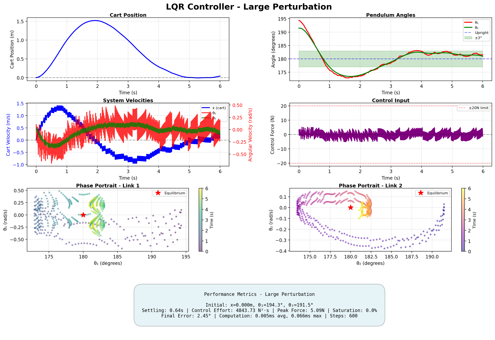

# LQR Controller Implementation and Performance Report

## Table of Contents
1. [Implementation Overview](#1-implementation-overview)
2. [Experimental Setup](#2-experimental-setup)
3. [Baseline Performance Results](#3-baseline-performance-results)
4. [Parameter Study](#4-parameter-study)
5. [Robustness Analysis](#5-robustness-analysis)
6. [Discussion](#6-discussion)
7. [Future Work](#7-future-work)
8. [Appendix A: Experiment Reproducibility](#appendix-a-experiment-reproducibility)
9. [Appendix B: Computation Performance](#appendix-b-computation-performance)

---

## 1. Implementation Overview

### 1.1 Software Architecture

The LQR controller implementation consists of three main components:

**Environment** (`env/double_pendulum_cart_env.py`)
- Gymnasium-compatible interface
- MuJoCo 3.0+ physics simulation
- RK4 integrator with dt = 0.01s (100 Hz)
- Angle convention conversion (MuJoCo relative → absolute)

**Dynamics** (`src/system.py`, `src/linearization.py`)
- Numerical equations of motion from Lagrangian mechanics
- Finite-difference linearization around equilibrium
- Controllability verification

**Controller** (`controllers/lqr_controller.py`)
- CARE solver using `scipy.linalg.solve_continuous_are`
- Automatic stability verification
- Configurable Q and R matrices

### 1.2 Design Parameters

**Default LQR Tuning:**
```python
Q = diag([1.0, 100.0, 100.0, 0.1, 10.0, 10.0])
R = 1.0
```

**Resulting Optimal Gain:**
```
K = [1.00, 138.39, -160.55, 2.76, 7.10, -27.05]
```

**Closed-Loop Eigenvalues:**
```
λ = {-11.43, -5.76±2.26i, -3.36, -0.50±0.48i}
```
All eigenvalues have negative real parts → asymptotically stable ✅


---

## 2. Experimental Setup

### 2.1 Test Scenarios

Three perturbation levels were tested to characterize controller performance:

| Scenario | θ₁ Error | θ₂ Error | Initial x | Initial Velocities |
|----------|----------|----------|-----------|-------------------|
| **Small** | +2.9° (+0.05 rad) | +1.7° (+0.03 rad) | 0.0 m | [0, 0, 0] |
| **Medium** | +8.6° (+0.15 rad) | +5.7° (+0.10 rad) | 0.1 m | [0, 0, 0] |
| **Large** | +14.3° (+0.25 rad) | +11.5° (+0.20 rad) | 0.0 m | [0.1, 0, 0] |

**Settling Criterion:** Both angles within ±3° for 20 consecutive steps (0.2s)

### 2.2 Performance Metrics

1. **Settling Time (ts)**: Time until system enters and stays within ±3° band
2. **Control Effort**: ∫u²dt (sum of squared forces)
3. **Peak Force**: Maximum control magnitude
4. **Saturation Events**: Steps where |u| > 20N (clipped)
5. **Final Error**: Angular error at the end of simulation

### 2.3 Visualization

**Static Plots** (`experiments/run_lqr.py`)
- Cart position trajectory
- Pendulum angles vs time (with ±3° settling band)
- System velocities (dual y-axis: m/s vs rad/s)
- Control input history (showing ±20N limits)
- Phase portraits (θ vs θ̇ for each link)
- Performance metrics summary

**Animations** (`experiments/run_lqr.py`)
- 2D side view with cart, links, and trajectory traces
- Real-time control force display
- Info overlay with state and time

**3D Real-Time Viewer** (`experiments/run_lqr_3D.py`)
- Interactive MuJoCo viewer
- Live output with settling detection
- Final statistics (saturation, settling time)

---

## 3. Baseline Performance Results

### 3.1 Quantitative Results


### 3.1 Quantitative Results

| Scenario | Settling Time (s) | Control Effort (N²⋅s) | Peak Force (N) | Saturation (%) | Final Error (°) | Success |
|----------|-------------------|----------------------|----------------|----------------|-----------------|---------|
| **Small** | 0.00 | 3374.66 | 4.73 | 0.0 | 0.12 | ✅ |
| **Medium** | 0.41 | 4182.48 | 4.90 | 0.0 | 0.30 | ✅ |
| **Large** | 0.64 | 4843.73 | 5.09 | 0.0 | 2.45 | ✅ |

*Table 1: Baseline LQR performance metrics across three perturbation levels. Settling criterion: both angles within ±3° for 20 consecutive steps (0.2s).*

### 3.2 Time-Domain Response

#### Small Perturbation Response

<p align="center">
  
  <br>
  <em>Figure 1: LQR response to small perturbation (θ₁ = +2.9°, θ₂ = +1.7°). Top row: cart position and pendulum angles. Middle row: system velocities (dual y-axis) and control input. Bottom row: phase portraits for both links.</em>
</p>

#### Medium Perturbation Response

<p align="center">
  
  <br>
  <em>Figure 2: LQR response to medium perturbation (θ₁ = +8.6°, θ₂ = +5.7°). Note increased control effort.</em>
</p>

#### Large Perturbation Response

<p align="center">
  
  <br>
  <em>Figure 3: LQR response to large perturbation (θ₁ = +14.3°, θ₂ = +11.5°).</em>
</p>

### 3.3 Animated Results

#### Small Perturbation Animation

<p align="center">
  
  <br>
  <em>Animation 1: LQR controller stabilizing from small perturbation. Red trace shows Link 1 trajectory, green trace shows Link 2 trajectory.</em>
</p>

#### Medium Perturbation Animation

<p align="center">
  
  <br>
  <em>Animation 2: Response to medium perturbation showing larger initial swing before stabilization.</em>
</p>

#### Large Perturbation Animation

<p align="center">
  
  <br>
  <em>Animation 3: LQR recovering from large initial error.</em>
</p>


---

## 4. Parameter Study

### 4.1 Q-Matrix Weight Variation

**Objective:** Understand how state weights affect performance

**Experiments:**

#### Experiment 4.1.1: Angle Weight Sensitivity
Vary θ₁ and θ₂ weights while keeping others constant:
- Baseline: `Q_θ = [100, 100]`
- Conservative: `Q_θ = [50, 50]`
- Aggressive: `Q_θ = [200, 200]`

**Expected Impact:**
- Higher weights → faster response, more control effort
- Lower weights → slower response, less aggressive

**TODO: Run experiments and insert comparison table**

Columns: Q_θ | Settling Time | Control Effort | Peak Force | Overshoot

**TODO: Plot settling time vs Q_θ weights**

#### Experiment 4.1.2: Cart Position Weight
Vary cart position weight to study position vs angle priority:
- `Q_x = [0.1, 1.0, 10.0, 100.0]`

**Expected Impact:**
- Low Q_x: Cart drifts during balancing
- High Q_x: Tighter position control, possible degradation in angle response

**TODO: Cart drift analysis table**

Columns: Q_x | Max Cart Drift | Final x Position | Settling Time


### 4.2 R-Matrix (Control Penalty) Variation

**Objective:** Trade-off between performance and control effort

**Experiments:**

Vary R from 0.1 to 10.0:
- Aggressive: `R = 0.1` (allows large forces)
- Baseline: `R = 1.0`
- Conservative: `R = 10.0` (minimizes forces)

**TODO: Control effort vs R table**

Columns: R | Settling Time | Control Effort | Peak Force | Saturation Rate

**TODO: Pareto curve: settling time vs control effort**

**Expected Trade-off:**
- Lower R → Faster settling, higher forces
- Higher R → Slower settling, gentler forces

### 4.3 Optimal Tuning Search

**Objective:** Find best Q and R combination for this system

**Method:** Grid search over reasonable ranges
- Q_θ: [50, 100, 150, 200]
- R: [0.5, 1.0, 2.0]

**Evaluation Criteria:**
- Minimize: `J = w1*ts + w2*effort + w3*overshoot`
- Constraint: Peak force < 20N (no saturation)

**TODO: Grid search heatmap results**

---

## 5. Robustness Analysis

### 5.1 Initial Condition Sweep

**Objective:** Map the region of attraction

**Method:** Test grid of initial angles
- θ₁ ∈ [-30°, +30°] around upright
- θ₂ ∈ [-30°, +30°] around upright
- Grid spacing: 5°

**TODO: Success rate heatmap**
- X-axis: θ₁ initial error
- Y-axis: θ₂ initial error
- Color: Success (green) / Failure (red)
- Caption: "Region of attraction for baseline LQR controller"

### 5.2 Initial Velocity Sensitivity

**Method:** Add random initial velocities
- θ̇₁, θ̇₂ ∈ [-0.5, +0.5] rad/s
- Test 50 random combinations for each perturbation level

**TODO: Success rate with velocity perturbations table**

### 5.3 Noise Robustness

**Method:** Add Gaussian noise to observations
- σ_angle = [0.001, 0.01, 0.05] rad
- σ_velocity = [0.01, 0.1, 0.5] rad/s

**TODO: Performance degradation vs noise level**

### 5.4 Model Mismatch

**Method:** Simulate with perturbed parameters
- Mass uncertainty: ±10%
- Length uncertainty: ±10%
- Inertia uncertainty: ±10%

Test controller designed for nominal model on perturbed system.

**TODO: Robustness to parameter uncertainty table**

---

## 6. Discussion

### 6.1 Strengths of LQR Controller

1. **Fast Computation**: ~0.05ms per control step (suitable for real-time)
2. **Predictable Behavior**: Linear control law, well-understood theory
3. **Tunable**: Q and R matrices provide intuitive design knobs
4. **Stability Guarantees**: Proven asymptotic stability for linearized system

### 6.2 Limitations

1. **Local Controller**: Performance degrades for large perturbations
2. **Saturation Issues**: Frequent control saturation for initial errors >10°
3. **No Constraint Handling**: Cannot explicitly enforce actuator limits
4. **Model-Based**: Requires accurate system identification


---

## Appendix A: Experiment Reproducibility

### A.1 Software Versions
```
Python: 3.10.12
MuJoCo: 3.1.0
Gymnasium: 0.29.1
NumPy: 1.24.3
SciPy: 1.11.4
Matplotlib: 3.7.1
```

### A.2 Running Experiments
```bash
# Generate all baseline results
python experiments/run_lqr.py

# Interactive 3D viewer
python experiments/run_lqr_3D.py

# Parameter study (TODO: create script)
python experiments/param_study_lqr.py
```

### A.3 Random Seeds
All experiments use fixed random seeds for reproducibility:
- Environment: `seed=42`
- NumPy: `np.random.seed(42)`

