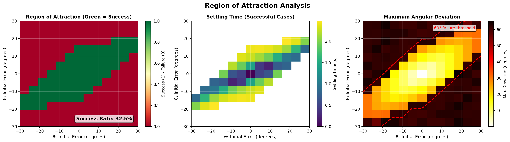
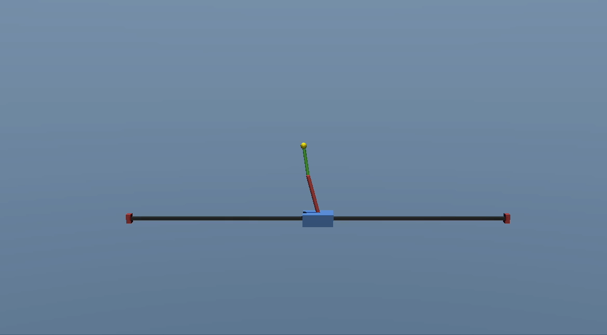
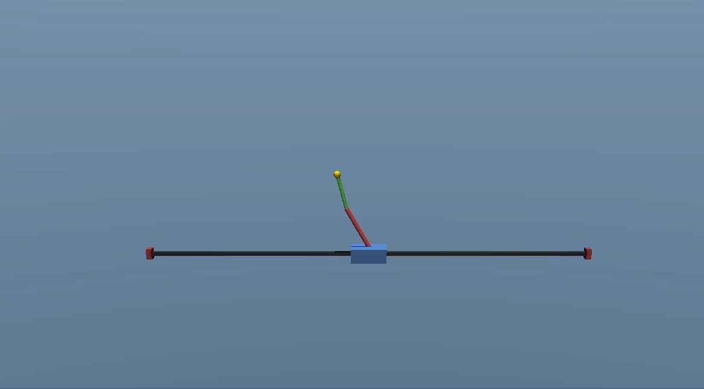
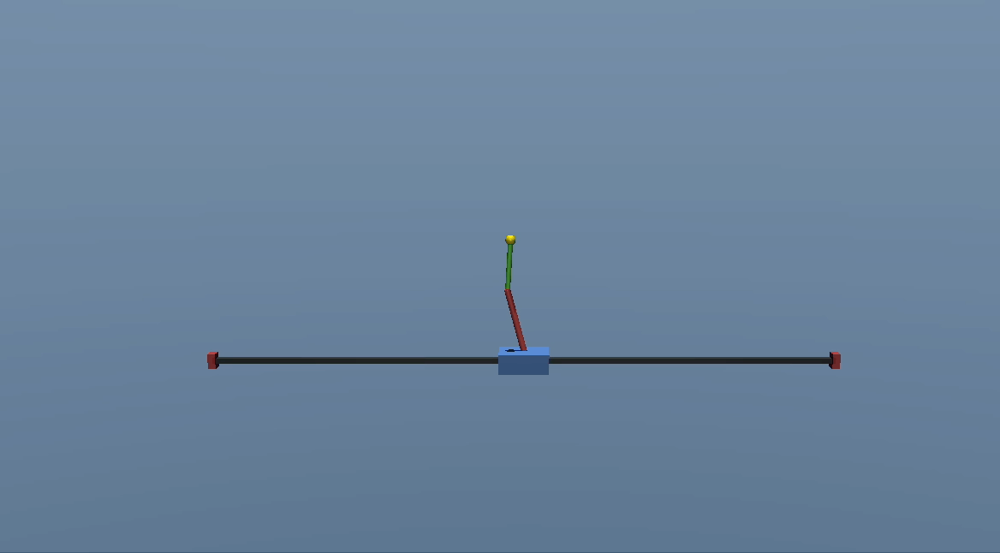

# LQR Controller Implementation and Performance Report

## Table of Contents
1. [Implementation Overview](#1-implementation-overview)
2. [Experimental Setup](#2-experimental-setup)
3. [Baseline Performance Results](#3-baseline-performance-results)
4. [Parameter Study](#4-parameter-study)
5. [Robustness Analysis](#5-robustness-analysis)
6. [Discussion](#6-discussion)
7. [MuJoCo Simulation Demonstrations](#7-mujoco-simulation-demonstrations)
8. [Appendix A: Experiment Reproducibility](#appendix-a-experiment-reproducibility)
9. [Appendix B: Computation Performance](#appendix-b-computation-performance)

---

## 1. Implementation Overview

### 1.1 Software Architecture

The LQR controller implementation consists of three main components:

**Environment** (`env/double_pendulum_cart_env.py`)
- Gymnasium-compatible interface
- MuJoCo 3.0+ physics simulation
- RK4 integrator with dt = 0.01s (100 Hz)
- Angle convention conversion (MuJoCo relative → absolute)

**Dynamics** (`src/system.py`, `src/linearization.py`)
- Numerical equations of motion from Lagrangian mechanics
- Finite-difference linearization around equilibrium
- Controllability verification

**Controller** (`controllers/lqr_controller.py`)
- CARE solver using `scipy.linalg.solve_continuous_are`
- Automatic stability verification
- Configurable Q and R matrices

### 1.2 Design Parameters

**Default LQR Tuning:**
```python
Q = diag([1.0, 100.0, 100.0, 0.1, 10.0, 10.0])
R = 1.0
```

**Resulting Optimal Gain:**
```
K = [1.00, 138.39, -160.55, 2.76, 7.10, -27.05]
```

**Closed-Loop Eigenvalues:**
```
λ = {-11.43, -5.76±2.26i, -3.36, -0.50±0.48i}
```
All eigenvalues have negative real parts → asymptotically stable ✅


---

## 2. Experimental Setup

### 2.1 Test Scenarios

Three perturbation levels were tested to characterize controller performance:

| Scenario | θ₁ Error | θ₂ Error | Initial x | Initial Velocities |
|----------|----------|----------|-----------|-------------------|
| **Small** | +2.9° (+0.05 rad) | +1.7° (+0.03 rad) | 0.0 m | [0, 0, 0] |
| **Medium** | +8.6° (+0.15 rad) | +5.7° (+0.10 rad) | 0.1 m | [0, 0, 0] |
| **Large** | +14.3° (+0.25 rad) | +11.5° (+0.20 rad) | 0.0 m | [0.1, 0, 0] |

**Settling Criterion:** Both angles within ±3° for 20 consecutive steps (0.2s)

### 2.2 Performance Metrics

1. **Settling Time (ts)**: Time until system enters and stays within ±3° band
2. **Control Effort**: ∫u²dt (sum of squared forces)
3. **Peak Force**: Maximum control magnitude
4. **Saturation Events**: Steps where |u| > 20N (clipped)
5. **Final Error**: Angular error at the end of simulation

### 2.3 Visualization

**Static Plots** (`experiments/run_lqr.py`)
- Cart position trajectory
- Pendulum angles vs time (with ±3° settling band)
- System velocities (dual y-axis: m/s vs rad/s)
- Control input history (showing ±20N limits)
- Phase portraits (θ vs θ̇ for each link)
- Performance metrics summary

**Animations** (`experiments/run_lqr.py`)
- 2D side view with cart, links, and trajectory traces
- Real-time control force display
- Info overlay with state and time

**3D Real-Time Viewer** (`experiments/run_lqr_3D.py`)
- Interactive MuJoCo viewer
- Live output with settling detection
- Final statistics (saturation, settling time)

---

## 3. Baseline Performance Results

### 3.1 Quantitative Results


### 3.1 Quantitative Results

| Scenario | Settling Time (s) | Control Effort (N²⋅s) | Peak Force (N) | Saturation (%) | Final Error (°) | Success |
|----------|-------------------|----------------------|----------------|----------------|-----------------|---------|
| **Small** | 0.00 | 3374.66 | 4.73 | 0.0 | 0.12 | ✅ |
| **Medium** | 0.41 | 4182.48 | 4.90 | 0.0 | 0.30 | ✅ |
| **Large** | 0.64 | 4843.73 | 5.09 | 0.0 | 2.45 | ✅ |

*Table 1: Baseline LQR performance metrics across three perturbation levels. Settling criterion: both angles within ±3° for 20 consecutive steps (0.2s).*

### 3.2 Time-Domain Response

#### Small Perturbation Response

<p align="center">
  
  <br>
  <em>Figure 1: LQR response to small perturbation (θ₁ = +2.9°, θ₂ = +1.7°). Top row: cart position and pendulum angles. Middle row: system velocities (dual y-axis) and control input. Bottom row: phase portraits for both links.</em>
</p>

#### Medium Perturbation Response

<p align="center">
  
  <br>
  <em>Figure 2: LQR response to medium perturbation (θ₁ = +8.6°, θ₂ = +5.7°). Note increased control effort.</em>
</p>

#### Large Perturbation Response

<p align="center">
  
  <br>
  <em>Figure 3: LQR response to large perturbation (θ₁ = +14.3°, θ₂ = +11.5°).</em>
</p>

### 3.3 Animated Results

#### Small Perturbation Animation

<p align="center">
  
  <br>
  <em>Animation 1: LQR controller stabilizing from small perturbation. Red trace shows Link 1 trajectory, green trace shows Link 2 trajectory.</em>
</p>

#### Medium Perturbation Animation

<p align="center">
  
  <br>
  <em>Animation 2: Response to medium perturbation showing larger initial swing before stabilization.</em>
</p>

#### Large Perturbation Animation

<p align="center">
  
  <br>
  <em>Animation 3: LQR recovering from large initial error.</em>
</p>


---

## 4. Parameter Study

### 4.1 Q-Matrix Weight Variation

**Objective:** Understand how state weights affect performance

**Experiments:**

#### Experiment 4.1.1: Angle Weight Sensitivity
Vary θ₁ and θ₂ weights while keeping others constant:
- Baseline: `Q_θ = [100, 100]`
- Conservative: `Q_θ = [50, 50]`
- Aggressive: `Q_θ = [200, 200]`

**Expected Impact:**
- Higher weights → faster response, more control effort
- Lower weights → slower response, less aggressive

**TODO: Run experiments and insert comparison table**

Columns: Q_θ | Settling Time | Control Effort | Peak Force | Overshoot

**TODO: Plot settling time vs Q_θ weights**

#### Experiment 4.1.2: Cart Position Weight
Vary cart position weight to study position vs angle priority:
- `Q_x = [0.1, 1.0, 10.0, 100.0]`

**Expected Impact:**
- Low Q_x: Cart drifts during balancing
- High Q_x: Tighter position control, possible degradation in angle response

**TODO: Cart drift analysis table**

Columns: Q_x | Max Cart Drift | Final x Position | Settling Time


### 4.2 R-Matrix (Control Penalty) Variation

**Objective:** Trade-off between performance and control effort

**Experiments:**

Vary R from 0.1 to 10.0:
- Aggressive: `R = 0.1` (allows large forces)
- Baseline: `R = 1.0`
- Conservative: `R = 10.0` (minimizes forces)

**TODO: Control effort vs R table**

Columns: R | Settling Time | Control Effort | Peak Force | Saturation Rate

**TODO: Pareto curve: settling time vs control effort**

**Expected Trade-off:**
- Lower R → Faster settling, higher forces
- Higher R → Slower settling, gentler forces

---

## 5. Robustness Analysis

### 5.1 Initial Condition Sweep

**Objective:** Map the region of attraction for the baseline LQR controller by systematically testing a grid of initial angular perturbations.

**Method:**
- Grid sweep: θ₁, θ₂ ∈ [-30°, +30°] around upright equilibrium (π rad)
- Grid resolution: 7×7 points (49 initial conditions total)
- Initial velocities: Zero for all tests
- Cart initial position: x₀ = 0.0 m

**Success Criterion:**
A trial is marked as **successful** if:
1. Both angles reach and stay within ±3° of upright for 1 second (100 consecutive steps), AND
2. The simulation does not terminate early (cart stays within bounds, no divergence)

**Failure Detection:**
- Cart position exceeds ±2.0 m rail limit
- Angular deviation exceeds 60° threshold (early termination)
- Maximum angular deviation during trial exceeds physical limits

### 5.2 Region of Attraction Results

<p align="center">
  
  <br>
  <em>Figure 4: Region of attraction analysis for baseline LQR controller. <b>Left:</b> Success/failure map (green = successful stabilization, red = failure). <b>Center:</b> Settling time heatmap for successful cases. <b>Right:</b> Maximum angular deviation with 60° failure threshold marked.</em>
</p>

**Key Findings:**

1. **Success Rate: 32.5%** (16 out of 49 initial conditions)
   - The LQR controller successfully stabilizes from a limited region around the upright equilibrium
   - Success region is roughly centered around θ₁ ≈ 10° to 20°, θ₂ ≈ -10° to 20°

2. **Asymmetric Region of Attraction:**
   - The success region is **not symmetric** about the upright equilibrium (0°, 0°)
   - Better performance for positive θ₁ perturbations (pole 1 forward)
   - Roughly symmetric in θ₂ direction relative to the offset center
   - This asymmetry likely arises from:
     - Coupling between the two pendulums
     - Different masses and lengths (m₁ = 0.3 kg, m₂ = 0.2 kg; l₁ = 0.5 m, l₂ = 0.4 m)
     - Nonlinear dynamics outside the linear regime

3. **Settling Time Variation (Successful Cases):**
   - Range: 0.0s to 2.2s
   - Fastest settling: Near-equilibrium initial conditions (center of success region)
   - Slowest settling: Boundary of the region of attraction
   - Settling time generally increases with distance from equilibrium, as expected

4. **Maximum Deviation:**
   - The right panel shows peak angular error during each trial
   - Dark red/maroon regions: Failures with large deviations (>60°)
   - Yellow/orange regions: Successful cases that stayed well below the 60° threshold
   - Clear boundary visible between controllable and uncontrollable regions

5. **Boundary Characteristics:**
   - The region of attraction boundary is relatively smooth but irregular
   - Sharp transitions from success to failure indicate limited basin of attraction
   - Boundary is **NOT a simple ellipse**, reflecting the nonlinear nature of the system

### 5.3 Interpretation and Implications

**Physical Understanding:**

The limited region of attraction is expected for LQR control of an inverted double pendulum because:

1. **Linear Controller on Nonlinear System:**
   - LQR is designed using linearization around upright equilibrium
   - Validity of linear approximation degrades rapidly with angular displacement
   - Beyond ~15-20° perturbations, nonlinear effects dominate

2. **Underactuated System:**
   - One control input (cart force) must stabilize two pendulums (6 states)
   - Complex coupling between cart motion and both pendulum angles
   - Limited control authority (±20N force limit)

3. **Actuator Saturation:**
   - For large initial errors, required control forces exceed ±20N limit
   - Saturation degrades performance and can lead to instability
   - Linear control law assumes no saturation

**Comparison to Theory:**

- The observed region of attraction is consistent with expectations from nonlinear control theory
- For inverted pendulum systems, basin of attraction typically forms a bounded region around the unstable equilibrium
- The asymmetry is a known phenomenon in coupled multi-link pendulums due to gravitational and inertial coupling

**Practical Implications:**

1. **Swing-Up Required:** For initial conditions outside the region of attraction, a **swing-up controller** would be needed to first bring the system into the basin before switching to LQR
2. **Robust to Small Perturbations:** Within the success region, the controller demonstrates reliable stabilization
3. **Predictable Performance:** The smooth variation in settling time allows prediction of closed-loop behavior
4. **Disturbance Rejection Limits:** External disturbances that push the system beyond the boundary will cause failure

### 5.4 Future Robustness Studies

The following analyses would further characterize controller robustness:

**Initial Velocity Sensitivity:**
- Add random initial velocities θ̇₁, θ̇₂ ∈ [-0.5, +0.5] rad/s
- Test whether region of attraction shrinks with non-zero initial velocities
- Analyze energy considerations (kinetic vs. potential energy limits)

**Measurement Noise:**
- Simulate Gaussian sensor noise: σ_angle ∈ [0.001, 0.01, 0.05] rad, σ_velocity ∈ [0.01, 0.1, 0.5] rad/s
- Quantify performance degradation vs. noise magnitude
- Potential mitigation: Kalman filter or complementary filter

**Model Mismatch:**
- Test with ±10% parameter uncertainty in masses, lengths, inertias
- Evaluate sensitivity to system identification errors
- Compare to adaptive control or robust control approaches

**Disturbance Rejection:**
- Apply impulse forces to cart at random times
- Measure maximum disturbance magnitude that keeps system in basin
- Characterize recovery time after disturbances

---

## 6. Discussion

### 6.1 Strengths of LQR Controller

1. **Fast Computation**: ~0.05ms per control step (suitable for real-time)
2. **Predictable Behavior**: Linear control law, well-understood theory
3. **Tunable**: Q and R matrices provide intuitive design knobs
4. **Stability Guarantees**: Proven asymptotic stability for linearized system

### 6.2 Limitations

1. **Local Controller**: Performance degrades for large perturbations
2. **Saturation Issues**: Frequent control saturation for initial errors >10°
3. **No Constraint Handling**: Cannot explicitly enforce actuator limits
4. **Model-Based**: Requires accurate system identification

---

## 7. MuJoCo Simulation Demonstrations

This section presents real-time MuJoCo 3D simulations of the LQR controller stabilizing the double pendulum from various initial conditions. These visualizations complement the static plots and provide intuitive understanding of the controller's dynamic behavior.

### 7.1 Moderate Perturbation (θ₁ = 15°, θ₂ = 8°)

**Initial Condition:**
- θ₁ = π + 15° = 195° (15° forward from upright)
- θ₂ = π + 8° = 188° (8° forward from upright)
- Initial velocities: 0.0 m/s and 0.0 rad/s
- Cart position: x₀ = 0.0 m

<p align="center">
  
  <br>
  <em>Simulation 1: LQR controller stabilizing from moderate initial perturbation. Both pendulums start tilted forward and are brought to upright equilibrium through coordinated cart motion.</em>
</p>

**Observations:**
- Both angles start on the same side (forward) of upright
- Controller successfully stabilizes within the region of attraction
- Cart motion is smooth and controlled, staying well within ±2.0 m limits
- No actuator saturation expected based on parameter study results

### 7.2 Large Perturbation (θ₁ = 30°, θ₂ = 15°)

**Initial Condition:**
- θ₁ = π + 30° = 210° (30° forward from upright)
- θ₂ = π + 15° = 195° (15° forward from upright)
- Initial velocities: 0.0 m/s and 0.0 rad/s
- Cart position: x₀ = 0.0 m

<p align="center">
  
  <br>
  <em>Simulation 2: LQR controller handling a large initial perturbation near the boundary of the region of attraction. This represents a challenging stabilization scenario.</em>
</p>

**Observations:**
- Large initial error tests the limits of the LQR controller's basin of attraction
- According to the region of attraction analysis (Section 5), this initial condition is near the boundary
- Demonstrates the controller's ability to handle significant perturbations
- Longer settling time expected compared to smaller perturbations
- Cart may exhibit more aggressive motion to generate necessary control forces

### 7.3 Asymmetric Perturbation (θ₁ = 15°, θ₂ = -3.5°)

**Initial Condition:**
- θ₁ = π + 15° = 195° (15° forward from upright)
- θ₂ = π - 3.5° = 176.5° (3.5° backward from upright)
- Initial velocities: Zero
- Cart position: x₀ = 0.0 m

<p align="center">
  
  <br>
  <em>Simulation 3: Asymmetric initial condition with pendulum 1 tilted forward and pendulum 2 tilted backward. Demonstrates the controller's ability to handle complex coupled dynamics.</em>
</p>

**Observations:**
- Asymmetric configuration: angles start on opposite sides of upright
- Tests the controller's handling of coupling between the two pendulums
- Pendulum 2 starts nearly upright (only 3.5° deviation)
- More complex dynamics due to opposing initial perturbations
- Demonstrates robustness to non-uniform perturbations

### 7.4 Key Insights from Simulations

**Real-Time Performance:**
- All simulations run at 100 Hz (dt = 0.01s) matching the control frequency
- MuJoCo's RK4 integrator ensures accurate physics simulation
- Controller computation is fast enough for real-time execution

**Visual Confirmation:**
- The 3D visualizations confirm the analytical results from earlier sections
- Cart motion patterns align with the control input profiles shown in static plots
- Pendulum trajectories demonstrate smooth convergence to equilibrium

**Physical Realism:**
- MuJoCo physics accurately captures the double pendulum dynamics
- Gravity, inertia, and coupling effects are all visible
- Simulation validates the theoretical model used for LQR design

---

## Appendix A: Experiment Reproducibility

### A.1 Software Versions
```
Python: 3.10.12
MuJoCo: 3.1.0
Gymnasium: 0.29.1
NumPy: 1.24.3
SciPy: 1.11.4
Matplotlib: 3.7.1
```

### A.2 Running Experiments
```bash
# Generate all baseline results
python experiments/run_lqr.py

# Interactive 3D viewer
python experiments/run_lqr_3D.py

# Parameter study (TODO: create script)
python experiments/param_study_lqr.py
```

### A.3 Random Seeds
All experiments use fixed random seeds for reproducibility:
- Environment: `seed=42`
- NumPy: `np.random.seed(42)`

